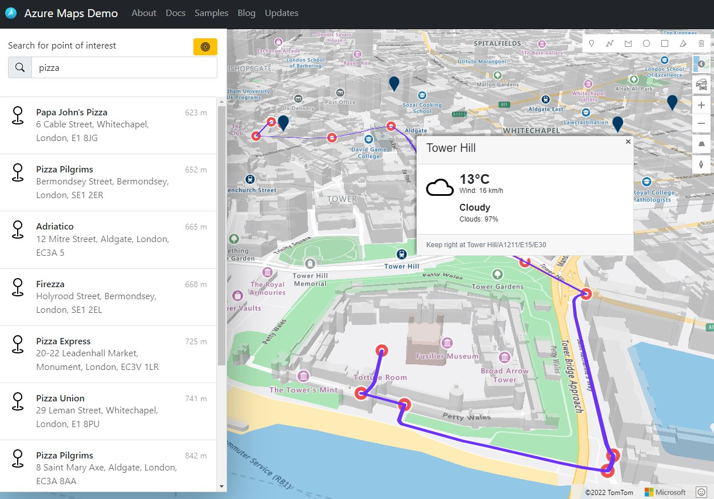

# Azure Maps Demo

On the [Azure Maps Demo](https://demo.azuremaps.com/) site, you can try out Azure Maps in the following scenarios:
* Select different map styles, including 3D and satellite tiles.
* Zoom, pan, and rotate the map
* Show trafic information
* Drawing on the map
* Search for point of interest
* Route to this point of interest
* Show route and weather information
* Locate me on the map

[Try it now](https://demo.azuremaps.com/)

## Related Projects

* [Azure Maps Web SDK Open modules](https://github.com/microsoft/Maps/blob/master/AzureMaps.md#open-web-sdk-modules) - A collection of open source modules that extend the Azure Maps Web SDK.
* [Azure Maps & Azure Active Directory Samples](https://github.com/Azure-Samples/Azure-Maps-AzureAD-Samples)
* [List of open-source Azure Maps projects](https://github.com/microsoft/Maps/blob/master/AzureMaps.md)

## Additional Resources

* [Azure Maps (main site)](https://azuremaps.com/)
* [Azure Maps Documentation](https://docs.azuremaps.com/)
* [Azure Maps Samples](https://samples.azuremaps.com/)
* [Azure Maps Demo](https://demo.azuremaps.com/)
* [Azure Maps Blog](https://blog.azuremaps.com/)
* [Azure Maps Updates](https://updates.azuremaps.com/)
* [Azure Maps Data feedback](https://feedback.azuremaps.com/)

## License

MIT
 
See [License](LICENSE.md) for full license text.
